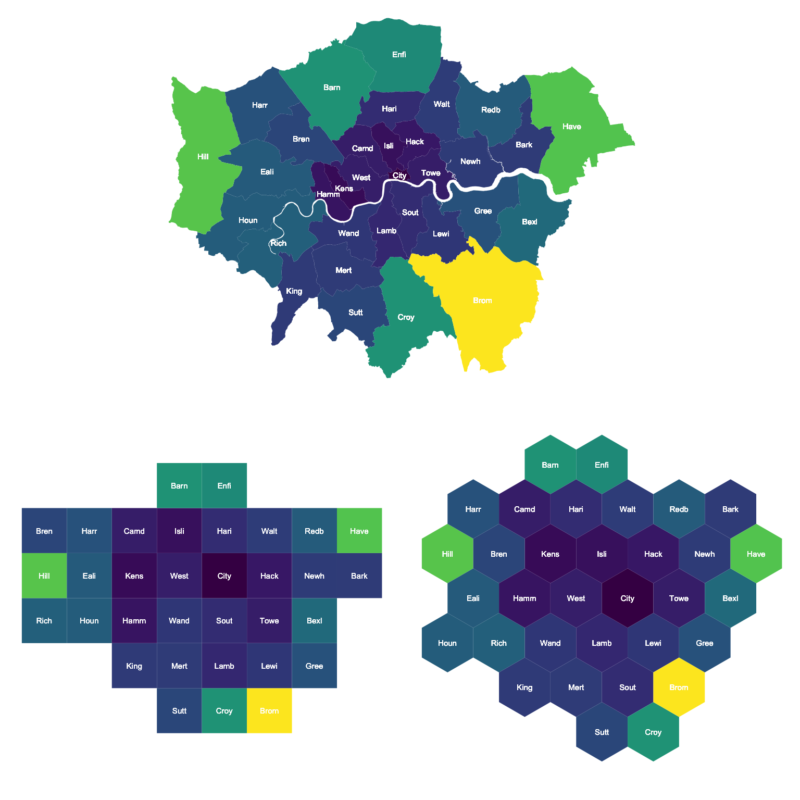

<!-- README.md is generated from README.Rmd. Please edit that file -->
```{r, echo = FALSE}
knitr::opts_chunk$set(collapse=TRUE, comment="##", fig.retina=2, fig.path = "README_figs/README-")
```

# hexmapr
Turn geospatial polygons like states, counties or local authorities into regular or hexagonal grids automatically. 



##Intro 
Using geospatial polygons to portray geographical information can be a challenge when polygons are of different sizes. For example, it can be difficult to ensure that larger polygons do not skew how readers retain or absorb information. As a result, many opt to generate maps that use consistent shapes (i.e. regular grids) to ensure that no specific geography is emphasised unfairly. Generally there are four reasons that one might transform geospatial polygons to a different grid (or geospatial representation):

1. We may use cartograms to represent the number of people (or any value) within a particular geography. For more information and examples see [here](https://www.wired.com/2016/10/electoral-maps-look-little-different-heres/) and [here](http://www.nytimes.com/interactive/2013/04/08/business/global/asia-map.html). This cartogram approach changes the size of a particular geography in-line with the values that one seeks to visualise. 
2. We may use grids to bin data and typically visualise the spatial density of a particular variable. For an example see [here](https://bl.ocks.org/mbostock/4330486).
3. We may use grids to segment a geographical region. For example tesselation can be used in [biological sampling](https://www.arcgis.com/home/item.html?id=03388990d3274160afe240ac54763e57) or even in generating [game environments](https://www.redblobgames.com/grids/hexagons/).
4. We may use grids to 'fairly' represent existing geographical entities (such as US states, UK local authorities, or even countries in Europe). For an example of representing US states as both regular and hexagonal grids see [here](http://blog.apps.npr.org/2015/05/11/hex-tile-maps.html).

The link in bullet 4 provides an excellent introduction to the notion of tesselation and its challenges. Interestingly, the eventual generation of hexagonal and regular grids demonstrated in the article was done **manually**. I believe that this can be very time consuming, and though it may stimulate some fun discussion - wouldn't it be great to do it automatically?

Recent functionality for representing US states, European countries and World countries in a grid has been made available for ggplot2 [here](https://hafen.github.io/geofacet/) and there are many other great examples of **hand-specified** or **bespoke** grids. The challenge with this is that if you have a less commonly used geography then it might be hard to find a  **hand-specified** or **bespoke** grid for your area of interest. 

What I wanted to do with `hexmapr` is make it easier to generate these grids in ways that might be visually appealing and then assign the original geographies to their gridded counterparts in a way that made sense. Using an input of geospatial polgyons `hexmapr` will generate either a regular or hexagonal grid, and then assign each of the polygons in your original file to that new grid. 

##Idea
There are two steps to using `hexmapr`:

1. Generate a regular or hexagonal grid of your choice. There are lots of different arrangements of these grids so choosing one with the `calculate_cell_size` function and varying the `seed` is a good place to start. 
2. Use the [**hungarian algorithm**](https://en.wikipedia.org/wiki/Hungarian_algorithm) to efficiently calculate the assignments from the original geography to the new geography. This involves identifying the solution where the total distance between the centroid of every original geography and its new centroid on the grid is minimised. For this I have included a previous implementation of the Hungarian algorithm kindly made available [here](https://github.com/RcppCore/rcpp-gallery/blob/gh-pages/src/2013-09-24-minimal-assignment.cpp). Huge thanks to Lars Simon Zehnder for this implementation.

## Example
This is a basic example which shows how the assignment of London boroughs could work. 
```{r example, message = FALSE, warning=FALSE, results='hide', fig.keep='all', fig.align='center'}
library(devtools)
library(ggplot2)
library(viridis)
library(plyr)
library(dplyr)
install_github("sassalley/hexmapr")
library(hexmapr)
library(gridExtra)

#In the working directory of the package.
input_file <- rep("inst/extdata/london_LA.json")
original_shapes <- read_polygons(input_file)
original_details <- get_shape_details(original_shapes)
```

For reference, lets see how London's local authorities are actually bounded in real space. In this example, I have coloured each polygon based on it's area. Yellower polygons are larger.
```{r example0, message = FALSE, warning=FALSE, results='hide', fig.keep='all', fig.align='center'}
raw <- read_polygons(input_file)
raw@data$xcentroid <- coordinates(raw)[,1]
raw@data$ycentroid <- coordinates(raw)[,2]


clean <- function(shape){
  shape@data$id = rownames(shape@data)
  shape.points = fortify(shape, region="id")
  shape.df = join(shape.points, shape@data, by="id")
}

result_df_raw <- clean(raw)
rawplot <- ggplot(result_df_raw) +
  geom_polygon( aes(x=long, y=lat, fill = HECTARES, group = group)) +
  geom_text(aes(xcentroid, ycentroid, label = substr(NAME,1,4)), size=2,color = "white") +
  coord_equal() +
  scale_fill_viridis() +
  guides(fill=FALSE) +
 theme_void()

rawplot
```


So, let's turn this into a grid to stop places like Bromley, Hillingdon and Havering from stealing our attention. First of all, we can generate a number of different grids using `seed`. Since there are many ways to dissect the outer boundary of the polygons you might want to choose an output that appeals to you. I'd reccomend looking at different `seed` values and choosing the one that best matches the outline that you approve of. 

The `calculate_cell_size` function takes in a SpatialPolygonsDataframe, details about the SpatialPolygonsDataframe (generated by `get_shape_details`), a learning rate (suggestion = 0.03 to begin), a grid type `hexagonal` or `regular` and a seed value. Let's have a look at some hexagonal grid options for the London local authorities: 
```{r example1, message = FALSE, warning=FALSE, results='hide', fig.keep='all', fig.align='center'}
par(mfrow=c(2,3), mar = c(0,0,2,0))
for (i in 1:6){
new_cells <-  calculate_cell_size(original_shapes, original_details,0.03, 'hexagonal', i)
plot(new_cells[[2]], main = paste("Seed",i, sep=" "))
}
```
Let's also look at things with a regular grid.
```{r example2, message = FALSE, warning=FALSE, results='hide', fig.keep='all', fig.align='center'}
par(mfrow=c(2,3), mar = c(0,0,2,0))
for (i in 1:6){
new_cells <-  calculate_cell_size(original_shapes, original_details,0.03, 'regular', i)
plot(new_cells[[2]], main = paste("Seed",i, sep=" "))
}
```

As we can see there are lots of options. Now, lets choose a grid and assign our existing places to it. I happen to like the both grids that have a `seed` of 3. So i'm going to assign the polygons to those grids. Let's do that and see what they look like compared to the original.
```{r example3, message = FALSE, warning=FALSE, results='hide', fig.keep='all', fig.align='center'}
new_cells_hex <-  calculate_cell_size(original_shapes, original_details,0.03, 'hexagonal', 3)
resulthex <- assign_polygons(original_shapes,new_cells_hex)

new_cells_reg <-  calculate_cell_size(original_shapes, original_details,0.03, 'regular', 3)
resultreg <- assign_polygons(original_shapes,new_cells_reg)
```

Now we have an example transfer from real space to grid space - we can visualise it. 
```{r example4, message = FALSE, warning=FALSE, results='hide', fig.keep='all', fig.align='center'}
result_df_hex <- clean(resulthex)
result_df_reg <- clean(resultreg)

hexplot <- ggplot(result_df_hex) +
  geom_polygon( aes(x=long, y=lat, fill = HECTARES, group = group)) +
  geom_text(aes(V1, V2, label = substr(NAME,1,4)), size=2,color = "white") +
  scale_fill_viridis() +
  coord_equal() +
  guides(fill=FALSE) +
 theme_void()

regplot <- ggplot(result_df_reg) +
  geom_polygon( aes(x=long, y=lat, fill = HECTARES, group = group)) +
  geom_text(aes(V1, V2, label = substr(NAME,1,4)), size=2,color = "white") +
  coord_equal() +
  scale_fill_viridis() +
  guides(fill=FALSE) +
 theme_void()

grid.arrange(rawplot,regplot, hexplot, layout_matrix = rbind(c(1,1),c(2,3)))

```

## Details

The package has four functions:

1. `read_polygons()`: this reads the geospatial polygons - essentially the `st_read` function from the package `sf`. Arguments:
    - `file`: a path to your input shapefile or geoJSON (generally) depending on installed drivers.
2. `get_shape_details()`: this extracts key information from the polygons such as the extent and the number of different polygons in the shape. These details are used in `calculate_cell_size()`. Arguments:
    - `input_shape`: your SpatialPolygonsDataframe read in by `read_polygons()`.
3. `calculate_cell_size()` given your input polygons this will generate the grid as specified by your arguments:
    - `shape`: the original polygons from `read_polygons()`
    - `shape_details`: the output object from `get_shape_details()`
    - `learning_rate`: the rate at which the gradient descent finds the optimum cellsize to ensure that your gridded points fit within the outer boundary of the input polygons.
    - `grid_type`: either `regular` for a square grid or `hexagonal` for a hexagonal grid. 
    - `seed`: the seed to ensure you get the same grid output. 
4. `assign_polygons()`: this will assign the original polygons to their new locations on the grid generated in `calculate_cell_size()`. It will find the solution that minimises the sum of the total distance between the original polygon centroids and eventual gridded centroids. Arguments:
    - `shape`: the original polygons from `read_polygons()`
    - `new_polygons`: the output (a list) from `calculate_cell_size()`.


## TODO

- Assignment may not always work - check the `assign_polygons()` why does it only work sometimes?
- Make it work (done i think), make it right (not yet), make it fast (not yet). 
- Complete formal R documentation.
- Add tests using `testthat`.
- Improve the cellsize calculation methodology. 
- See if we can make it CRAN-worthy.
- Get someone to answer [this stack overflow question](https://math.stackexchange.com/questions/2388000/find-topologically-closest-graph-under-constraints).

## Notes

This is my first attempt at a package and it is not yet correctly documented and test coverage is non-existent. I am in the process of implementing these things. Hopefully the package is small enough and the functions are simple enough that critiquing them is not too challenging. If it doesn't work i'd like suggestions for improvements and thanks in advance for providing them!

I welcome critique and feedback. Blog post to follow. 

## Thanks

I read a lot of the work by [Hadley Wickham](http://hadley.nz/), [Jenny Bryan](https://github.com/jennybc), [Thomas Lin Pedersen](https://www.data-imaginist.com/about/) and [Bob Rudis](https://github.com/hrbrmstr) to name a few. But also love the R community and learn a huge amount from [R Bloggers](https://www.r-bloggers.com/). 

# Other examples
This time using the contiguous USA. Again, I used set seed and chose some that I liked but i'd reccomend you'd do the same. 
```{r example5, message = FALSE, warning=FALSE, results='hide', fig.keep='all', fig.align='center'}
#In the working directory of the package.
input_file <- rep("inst/extdata/states.json")
original_shapes <- read_polygons(input_file)
original_details <- get_shape_details(original_shapes)
raw <- read_polygons(input_file)
raw@data$xcentroid <- coordinates(raw)[,1]
raw@data$ycentroid <- coordinates(raw)[,2]

result_df_raw <- clean(raw)
rawplot <- ggplot(result_df_raw) +
  geom_polygon( aes(x=long, y=lat, fill = CENSUSAREA, group = group)) +
  geom_text(aes(xcentroid, ycentroid, label = substr(NAME,1,4)), size=2,color = "white") +
  coord_equal() +
  scale_fill_viridis() +
  guides(fill=FALSE) +
 theme_void()

```
Let's check the seeds again.
```{r example6, message = FALSE, warning=FALSE, results='hide', fig.keep='all', fig.align='center'}
par(mfrow=c(2,3), mar = c(0,0,2,0))
for (i in 1:6){
new_cells <-  calculate_cell_size(original_shapes, original_details,0.03, 'hexagonal', i)
plot(new_cells[[2]], main = paste("Seed",i, sep=" "))
}
```

```{r example6a, message = FALSE, warning=FALSE, results='hide', fig.keep='all', fig.align='center'}
par(mfrow=c(2,3), mar = c(0,0,2,0))
for (i in 1:6){
new_cells <-  calculate_cell_size(original_shapes, original_details,0.03, 'regular', i)
plot(new_cells[[2]], main = paste("Seed",i, sep=" "))
}
```

Now we've seen some seed demo's lets assign them...
```{r example7, message = FALSE, warning=FALSE, results='hide', fig.keep='all', fig.align='center'}
new_cells_hex <-  calculate_cell_size(original_shapes, original_details,0.03, 'hexagonal', 6)
resulthex <- assign_polygons(original_shapes,new_cells_hex)

new_cells_reg <-  calculate_cell_size(original_shapes, original_details,0.03, 'regular', 4)
resultreg <- assign_polygons(original_shapes,new_cells_reg)

result_df_hex <- clean(resulthex)
result_df_reg <- clean(resultreg)

hexplot <- ggplot(result_df_hex) +
  geom_polygon( aes(x=long, y=lat, fill = CENSUSAREA, group = group)) +
  geom_text(aes(V1, V2, label = substr(NAME,1,4)), size=2,color = "white") +
  scale_fill_viridis() +
  coord_equal() +
  guides(fill=FALSE) +
 theme_void()

regplot <- ggplot(result_df_reg) +
  geom_polygon( aes(x=long, y=lat, fill = CENSUSAREA, group = group)) +
  geom_text(aes(V1, V2, label = substr(NAME,1,4)), size=2,color = "white") +
  coord_equal() +
  scale_fill_viridis() +
  guides(fill=FALSE) +
 theme_void()

grid.arrange(rawplot,regplot, hexplot, layout_matrix = rbind(c(1,1),c(2,3)))
```

Likewise, you can try the bay area...
```{r example8, message = FALSE, warning=FALSE, results='hide', fig.keep='all', fig.align='center'}
#In the working directory of the package.
input_file <- rep("inst/extdata/bay_counties.geojson")
original_shapes <- read_polygons(input_file)
original_details <- get_shape_details(original_shapes)
raw <- read_polygons(input_file)
raw@data$xcentroid <- coordinates(raw)[,1]
raw@data$ycentroid <- coordinates(raw)[,2]

result_df_raw <- clean(raw)
rawplot <- ggplot(result_df_raw) +
  geom_polygon( aes(x=long, y=lat, group = group)) +
  geom_text(aes(xcentroid, ycentroid, label = substr(county,1,4)), size=2,color = "white") +
  coord_equal() +
  guides(fill=FALSE) +
 theme_void()

new_cells_hex <-  calculate_cell_size(original_shapes, original_details,0.03, 'hexagonal', 6)
resulthex <- assign_polygons(original_shapes,new_cells_hex)

new_cells_reg <-  calculate_cell_size(original_shapes, original_details,0.03, 'regular', 1)
resultreg <- assign_polygons(original_shapes,new_cells_reg)

result_df_hex <- clean(resulthex)
result_df_reg <- clean(resultreg)

hexplot <- ggplot(result_df_hex) +
  geom_polygon( aes(x=long, y=lat, group = group)) +
  geom_text(aes(V1, V2, label = substr(county,1,4)), size=2,color = "white") +
  coord_equal() +
  guides(fill=FALSE) +
 theme_void()

regplot <- ggplot(result_df_reg) +
  geom_polygon( aes(x=long, y=lat, group = group)) +
  geom_text(aes(V1, V2, label = substr(county,1,4)), size=2,color = "white") +
  coord_equal() +
  guides(fill=FALSE) +
 theme_void()

grid.arrange(rawplot,regplot, hexplot, layout_matrix = rbind(c(1,1),c(2,3)))
```