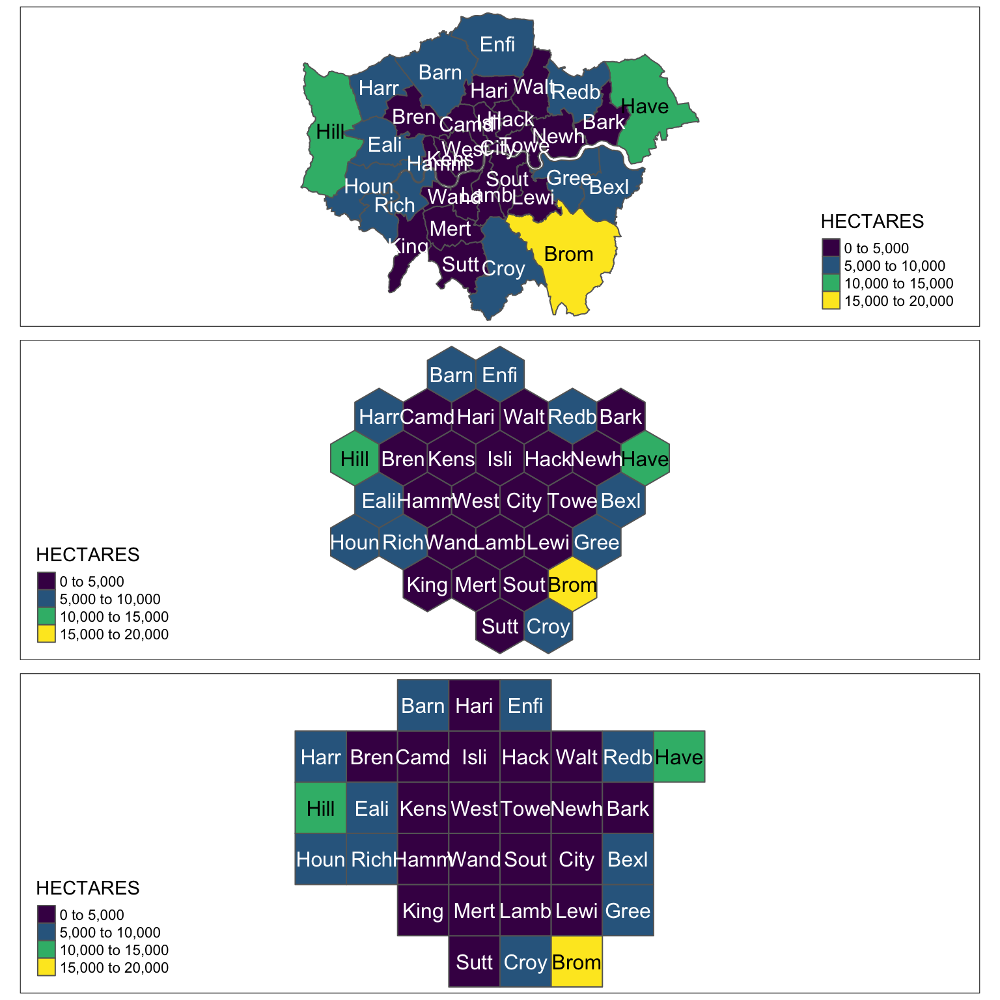
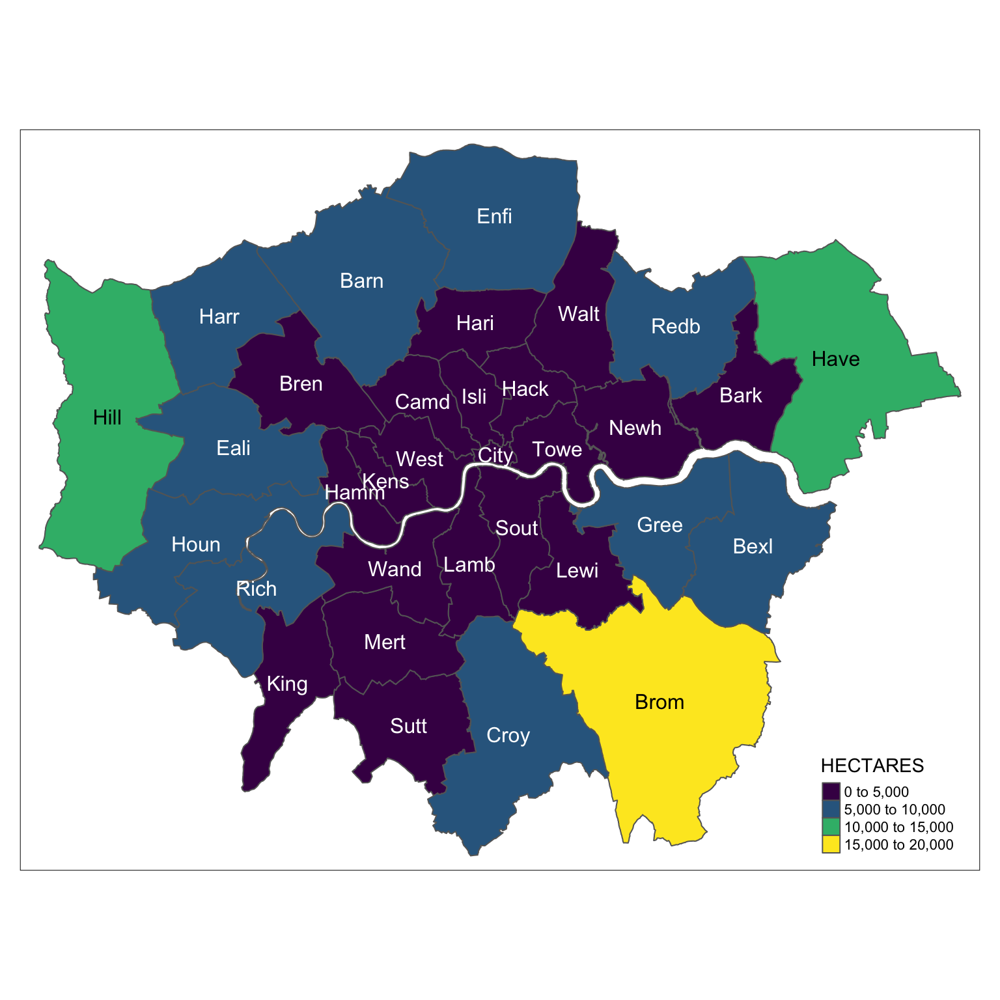
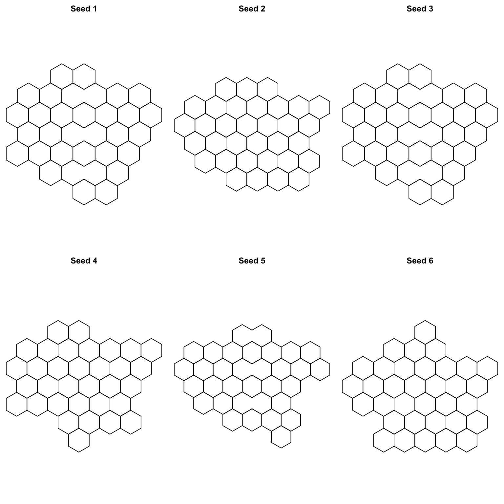
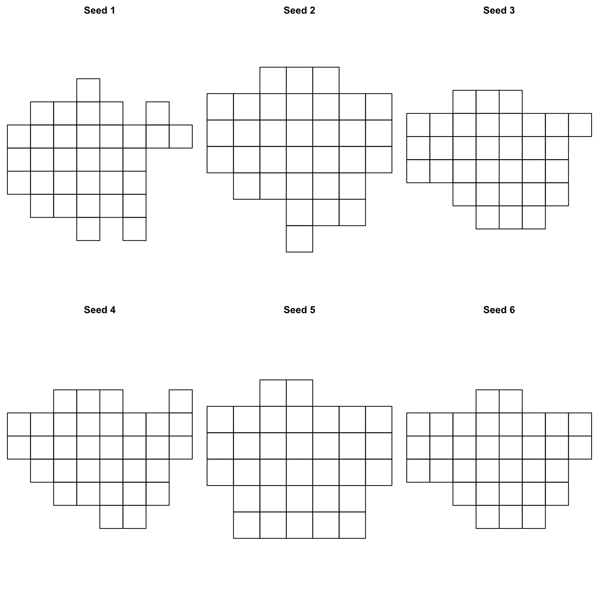
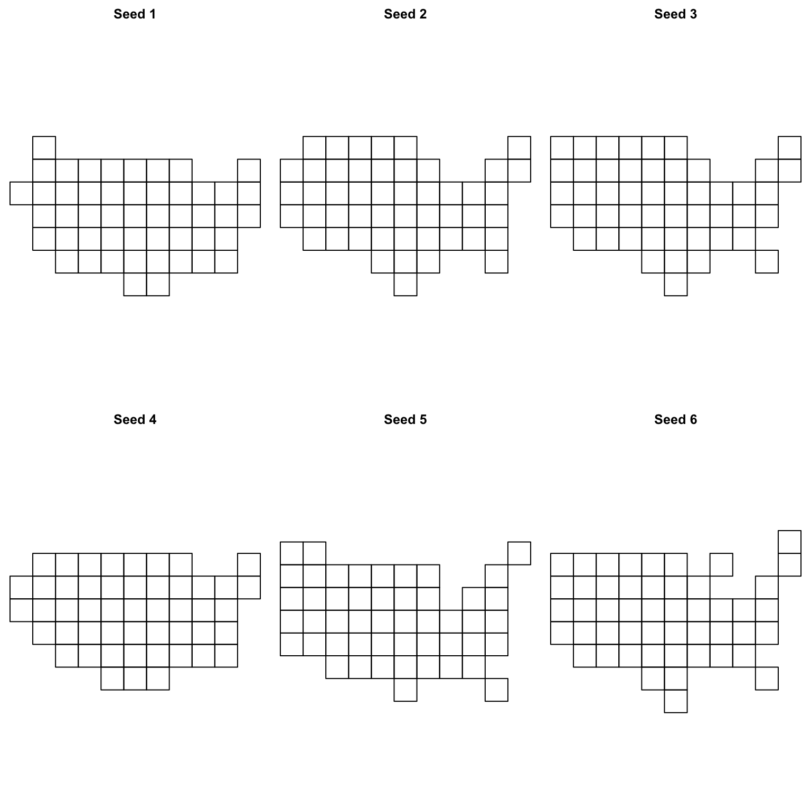
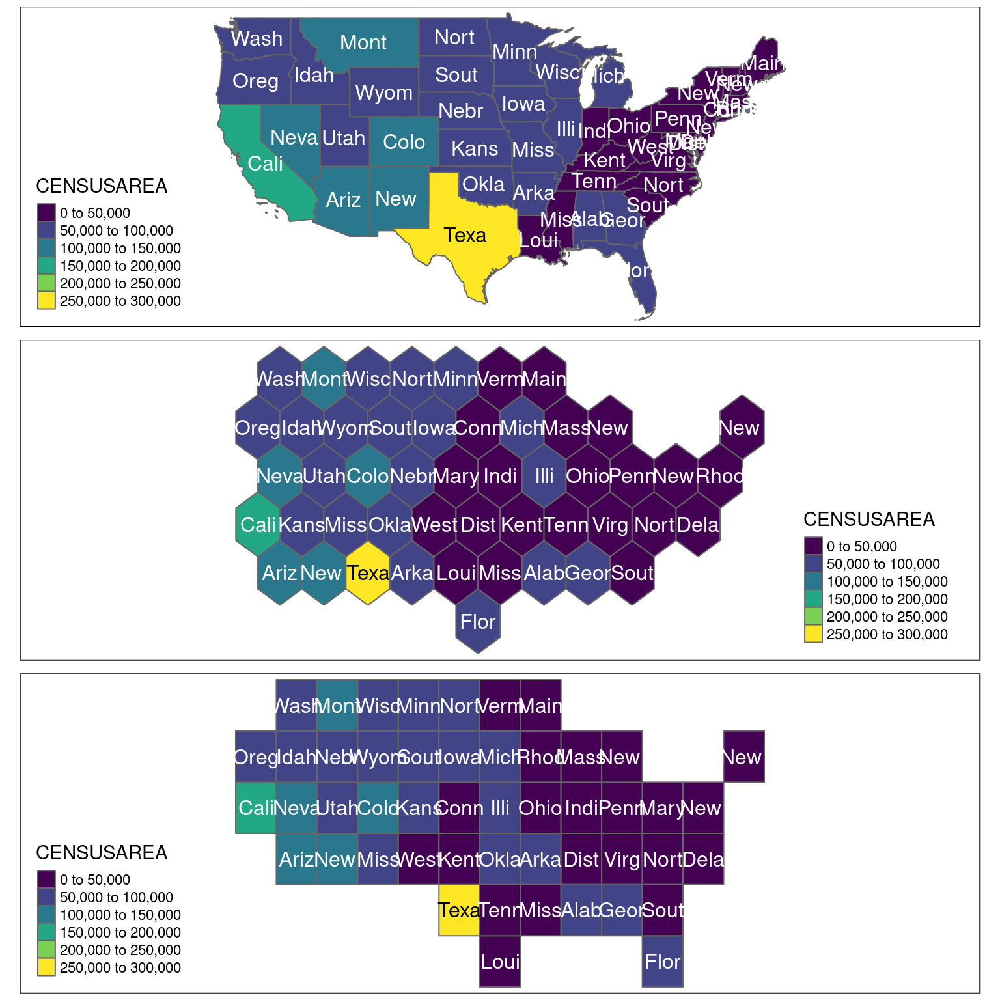
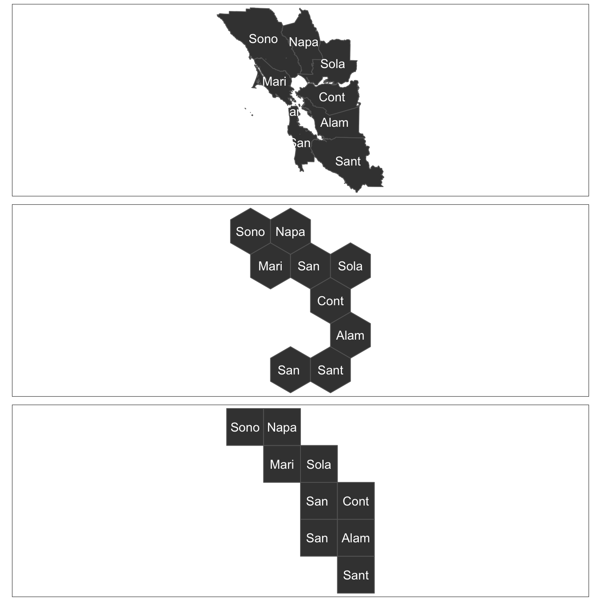

Algorithmic tesselation with geogrid
================
Joseph Bailey
2018-12-07

<!-- README.md is generated from README.Rmd. Please edit that file -->

[](https://travis-ci.org/jbaileyh/geogrid)
[](https://cran.r-project.org/package=geogrid)
[](https://codecov.io/github/jbaileyh/geogrid?branch=master)

# geogrid

Turn geospatial polygons like states, counties or local authorities into
regular or hexagonal grids
automatically.



## Intro

Using geospatial polygons to portray geographical information can be a
challenge when polygons are of different sizes. For example, it can be
difficult to ensure that larger polygons do not skew how readers retain
or absorb information. As a result, many opt to generate maps that use
consistent shapes (i.e. regular grids) to ensure that no specific
geography is emphasised unfairly. Generally there are four reasons that
one might transform geospatial polygons to a different grid (or
geospatial representation):

1.  We may use cartograms to represent the number of people (or any
    value) within a particular geography. For more information and
    examples see
    [here](https://www.wired.com/2016/10/electoral-maps-look-little-different-heres/)
    and
    [here](http://www.nytimes.com/interactive/2013/04/08/business/global/asia-map.html).
    This cartogram approach changes the size of a particular geography
    in-line with the values that one seeks to visualise.
2.  We may use grids to bin data and typically visualise the spatial
    density of a particular variable. For an example see
    [here](https://bl.ocks.org/mbostock/4330486).
3.  We may use grids to segment a geographical region. For example
    tesselation can be used in [biological
    sampling](https://www.arcgis.com/home/item.html?id=03388990d3274160afe240ac54763e57)
    or even in generating [game
    environments](https://www.redblobgames.com/grids/hexagons/).
4.  We may use grids to ‘fairly’ represent existing geographical
    entities (such as US states, UK local authorities, or even countries
    in Europe). For an example of representing US states as both regular
    and hexagonal grids see
    [here](http://blog.apps.npr.org/2015/05/11/hex-tile-maps.html).

The link in bullet 4 provides an excellent introduction to the notion of
tesselation and its challenges. Interestingly, the eventual generation
of hexagonal and regular grids demonstrated in the article was done
**manually**. I believe that this can be very time consuming, and though
it may stimulate some fun discussion - wouldn’t it be great to do it
automatically?

Recent functionality for representing US states, European countries and
World countries in a grid has been made available for ggplot2
[here](https://hafen.github.io/geofacet/) and there are many other great
examples of **hand-specified** or **bespoke** grids. The challenge with
this is that if you have a less commonly used geography then it might be
hard to find a **hand-specified** or **bespoke** grid for your area of
interest.

What I wanted to do with `geogrid` is make it easier to generate these
grids in ways that might be visually appealing and then assign the
original geographies to their gridded counterparts in a way that made
sense. Using an input of geospatial polgyons `geogrid` will generate
either a regular or hexagonal grid, and then assign each of the polygons
in your original file to that new grid.

## Idea

There are two steps to using `geogrid`:

1.  Generate a regular or hexagonal grid of your choice. There are lots
    of different arrangements of these grids so choosing one with the
    `calculate_grid` function and varying the `seed` is a good place to
    start.
2.  Use the [**hungarian
    algorithm**](https://en.wikipedia.org/wiki/Hungarian_algorithm) to
    efficiently calculate the assignments from the original geography to
    the new geography. This involves identifying the solution where the
    total distance between the centroid of every original geography and
    its new centroid on the grid is minimised. For this I have included
    a previous implementation of the Hungarian algorithm kindly made
    available
    [here](https://github.com/RcppCore/rcpp-gallery/blob/gh-pages/src/2013-09-24-minimal-assignment.cpp).
    Huge thanks to Lars Simon Zehnder for this implementation.

## Example

This is a basic example which shows how the assignment of London
boroughs could work.

``` r
library(geogrid)
library(sf)
library(tmap)

input_file <- system.file("extdata", "london_LA.json", package = "geogrid")
original_shapes <- st_read(input_file) %>% st_set_crs(27700)
original_shapes$SNAME <- substr(original_shapes$NAME, 1, 4)
```

For reference, lets see how London’s local authorities are actually
bounded in real space. In this example, I have coloured each polygon
based on it’s area. Brighter polygons are larger.

``` r
rawplot <- tm_shape(original_shapes) + 
  tm_polygons("HECTARES", palette = "viridis") +
  tm_text("SNAME")
rawplot
```



So, let’s turn this into a grid to stop places like Bromley, Hillingdon
and Havering from stealing our attention. First of all, we can generate
a number of different grids using `seed`. Since there are many ways to
dissect the outer boundary of the polygons you might want to choose an
output that appeals to you. I’d recommend looking at different `seed`
values and choosing the one that best matches the outline that you
approve of.

The `calculate_grid` function takes in a SpatialPolygonsDataframe or sf
object, a learning rate (suggestion = 0.03 to begin), a grid type
`hexagonal` or `regular` and a seed value. Let’s have a look at some
hexagonal grid options for the London local authorities:

``` r
par(mfrow = c(2, 3), mar = c(0, 0, 2, 0))
for (i in 1:6) {
  new_cells <- calculate_grid(shape = original_shapes, grid_type = "hexagonal", seed = i)
  plot(new_cells, main = paste("Seed", i, sep = " "))
}
```



Let’s also look at things with a regular grid:

``` r
par(mfrow = c(2, 3), mar = c(0, 0, 2, 0))
for (i in 1:6) {
  new_cells <- calculate_grid(shape = original_shapes, grid_type = "regular", seed = i)
  plot(new_cells, main = paste("Seed", i, sep = " "))
}
```



As we can see there are lots of options. Now, lets choose a grid and
assign our existing places to it. I happen to like the both grids that
have a `seed` of 3. So I’m going to assign the polygons to those grids.
Let’s do that and see what they look like compared to the
original.

``` r
new_cells_hex <- calculate_grid(shape = original_shapes, grid_type = "hexagonal", seed = 3)
resulthex <- assign_polygons(original_shapes, new_cells_hex)

new_cells_reg <- calculate_grid(shape = original_shapes, grid_type = "regular", seed = 3)
resultreg <- assign_polygons(original_shapes, new_cells_reg)
```

Now we have an example transfer from real space to grid space - we can
visualise it.

``` r
hexplot <- tm_shape(resulthex) + 
  tm_polygons("HECTARES", palette = "viridis") +
  tm_text("SNAME")

regplot <- tm_shape(resultreg) + 
  tm_polygons("HECTARES", palette = "viridis") +
  tm_text("SNAME")

tmap_arrange(rawplot, hexplot, regplot, nrow = 3)
```


## Details

The package has two major functions:

1.  `calculate_grid()` given your input polygons this will generate the
    grid as specified by your arguments:
      - `shape`: the original polygons
      - `learning_rate`: the rate at which the gradient descent finds
        the optimum cellsize to ensure that your gridded points fit
        within the outer boundary of the input polygons.
      - `grid_type`: either `regular` for a square grid or `hexagonal`
        for a hexagonal grid.
      - `seed`: the seed to ensure you get the same grid output.
2.  `assign_polygons()`: this will assign the original polygons to their
    new locations on the grid generated in `calculate_grid()`. It will
    find the solution that minimises the sum of the total distance
    between the original polygon centroids and eventual gridded
    centroids. Arguments:
      - `shape`: the original polygons
      - `new_polygons`: the output (a list) from `calculate_grid()`.

## TODO

  - Assignment may not always work - check the `assign_polygons()` why
    does it only work sometimes?
  - Make it work (done I think), make it right (not yet), make it fast
    (not yet).
  - Improve the cellsize calculation methodology.
  - Get someone to answer [this stack overflow
    question](https://math.stackexchange.com/questions/2388000/find-topologically-closest-graph-under-constraints).

## Notes

This is my first attempt at a package. If it doesn’t work I’d like
suggestions for improvements and thanks in advance for providing them\!

I welcome critique and feedback. Blog post to follow.

## Thanks

I read a lot of the work by [Hadley Wickham](http://hadley.nz/), [Jenny
Bryan](https://github.com/jennybc), [Thomas Lin
Pedersen](https://www.data-imaginist.com/about/), [Mara
Averick](https://twitter.com/dataandme?lang=en) and [Bob
Rudis](https://github.com/hrbrmstr) to name a few. But also love the R
community and learn a huge amount from [R
Bloggers](https://www.r-bloggers.com/).

Extra thanks go to [Ryan Hafen](http://ryanhafen.com/) for making this
package publishable.

# Other examples

From others:

Simon Hailstone has looked at [male life expectancy in the South East
region of England](http://rpubs.com/Hailstone/326118) using the package.
Thanks Simon for using\!

From me:

This time using the contiguous USA. Again, I used set seed and chose
some that I liked but I’d recommend you’d do the
same.

``` r
input_file2 <- system.file("extdata", "states.json", package = "geogrid")
original_shapes2 <- st_read(input_file2) %>% st_transform(2163)
original_shapes2$SNAME <- substr(original_shapes2$NAME, 1, 4)
  
rawplot2 <- tm_shape(original_shapes2) +
  tm_polygons("CENSUSAREA", palette = "viridis") +
  tm_text("SNAME")
```

Let’s check the seeds again.

``` r
par(mfrow = c(2, 3), mar = c(0, 0, 2, 0))
for (i in 1:6) {
  new_cells <- calculate_grid(shape = original_shapes2, grid_type = "hexagonal", seed = i)
  plot(new_cells, main = paste("Seed", i, sep = " "))
}
```


``` r
par(mfrow = c(2, 3), mar = c(0, 0, 2, 0))
for (i in 1:6) {
  new_cells <- calculate_grid(shape = original_shapes2, grid_type = "regular", seed = i)
  plot(new_cells, main = paste("Seed", i, sep = " "))
}
```



Now we’ve seen some seed demo’s lets assign
them…

``` r
new_cells_hex2 <- calculate_grid(shape = original_shapes2, grid_type = "hexagonal", seed = 6)
resulthex2 <- assign_polygons(original_shapes2, new_cells_hex2)

new_cells_reg2 <- calculate_grid(shape = original_shapes2, grid_type = "regular", seed = 4)
resultreg2 <- assign_polygons(original_shapes2, new_cells_reg2)

hexplot2 <- tm_shape(resulthex2) + 
  tm_polygons("CENSUSAREA", palette = "viridis") +
  tm_text("SNAME")

regplot2 <- tm_shape(resultreg2) + 
  tm_polygons("CENSUSAREA", palette = "viridis") +
  tm_text("SNAME")

tmap_arrange(rawplot2, hexplot2, regplot2, nrow = 3)
```



Likewise, you can try the bay
area…

``` r
input_file3 <- system.file("extdata", "bay_counties.geojson", package = "geogrid")
original_shapes3 <- st_read(input_file3) %>% st_transform(3310)
original_shapes3$SNAME <- substr(original_shapes3$county, 1, 4)
  
rawplot3 <- tm_shape(original_shapes3) +
  tm_polygons(col = "gray25") +
  tm_text("SNAME")

new_cells_hex3 <- calculate_grid(shape = original_shapes3, grid_type = "hexagonal", seed = 6)
resulthex3 <- assign_polygons(original_shapes3, new_cells_hex3)

new_cells_reg3 <- calculate_grid(shape = original_shapes3, grid_type = "regular", seed = 1)
resultreg3 <- assign_polygons(original_shapes3, new_cells_reg3)

hexplot3 <- tm_shape(resulthex3) + 
  tm_polygons(col = "gray25") +
  tm_text("SNAME")

regplot3 <- tm_shape(resultreg3) + 
  tm_polygons(col = "gray25") +
  tm_text("SNAME")

tmap_arrange(rawplot3, hexplot3, regplot3, nrow = 3)
```


